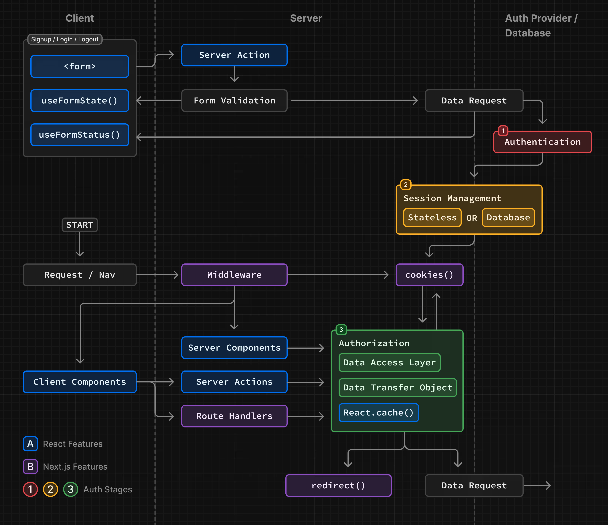

<div align="center">

# 🔐 Next.js Secure OBS

**Sistema de autenticação JWT com cookies HttpOnly, dashboard SSR protegido e monitoramento Sentry**



[](https://nextjs.org/)
[](https://typescriptlang.org/)
[](https://tanstack.com/query)
[](https://sentry.io/)

[🚀 Demo](#demo--telas) • [📚 Docs](#índice) • [⚡ Quick Start](#início-rápido) • [🛡️ Security](#decisões-de-segurança)

</div>

---

<details>
<summary><b>📚 Índice</b></summary>

### 🚀 **Getting Started**
- [🎯 Features](#-features)
- [⚡ Início Rápido](#-início-rápido)
- [🔧 Variáveis de Ambiente](#-variáveis-de-ambiente)

### 🏗️ **Arquitetura**
- [📁 Estrutura de Pastas](#arquitetura--estrutura-de-pastas)
- [🔐 Design de Autenticação](#design-de-autenticação)
- [🗃️ Data Access Layer (DAL)](#data-access-layer-dal)
- [⚡ Busca de Dados Client-Side](#busca-de-dados-client-side)

### 🛠️ **Implementação**
- [🚨 Integração Sentry](#integração-sentry)
- [✅ Especificações Implementadas](#especificações-implementadas)
- [🛡️ Decisões de Segurança](#decisões-de-segurança)

### 📋 **Referência**
- [⚠️ Limitações](#limitações)
- [⚖️ Trade-offs](#trade-offs)
- [🧪 Testes & Validação](#testes--validação)

</details>

## 🎯 Features

<table>
<tr>
<td width="50%">

### 🔐 **Autenticação Segura**
- JWT em cookies HttpOnly
- Proteção CSRF com SameSite
- Refresh token automático
- Redirecionamento inteligente

</td>
<td width="50%">

### 📊 **Dashboard SSR**
- Renderização server-side
- Data fetching otimizado
- Proteção de rotas
- APIs mock integradas

</td>
</tr>
<tr>
<td width="50%">

### ⚡ **React Query**
- Cache automático
- Estados gerenciados
- Revalidação em background
- Error handling integrado

</td>
<td width="50%">

### 🚨 **Monitoramento**
- Integração Sentry completa
- Captura client & server-side
- Error tracking em tempo real
- Performance monitoring

</td>
</tr>
</table>

## ⚡ Início Rápido

<details>
<summary><b>📋 Pré-requisitos</b></summary>

- **Node.js** `18.0.0` ou superior
- **npm** / **yarn** / **pnpm**
- Conta **Sentry** (opcional, para monitoramento)

</details>

### 🚀 Instalação

```bash
# Clone o repositório
git clone https://github.com/seu-usuario/nextjs-secure-obs.git
cd nextjs-secure-obs

# Instale as dependências
npm install

# Configure as variáveis de ambiente
cp .env.example .env
# Edite o .env com suas configurações

# Inicie o servidor de desenvolvimento
npm run dev
```

<div align="center">

**🎉 Aplicação rodando em** [`http://localhost:3004`](http://localhost:3004)

</div>

### 🔧 Scripts Disponíveis

| Script | Descrição |
|--------|-----------|
| `npm run dev` | Inicia servidor de desenvolvimento |
| `npm run build` | Gera build de produção |
| `npm run start` | Inicia servidor de produção |
| `npm run lint` | Executa ESLint |
| `npm run typecheck` | Verifica tipos TypeScript |

## 🔧 Variáveis de Ambiente

<details>
<summary><b>⚙️ Configuração do .env</b></summary>

```bash
cp .env.example .env
```

| Variável | Obrigatória | Descrição |
|----------|-------------|-----------|
| `SESSION_SECRET` | ✅ | Chave secreta para sessões (≥32 chars, HS256) |
| `JWT_SECRET` | ✅ | Chave secreta para JWT tokens |
| `SENTRY_DSN` | ❌ | DSN do Sentry para monitoramento |
| `SENTRY_AUTH_TOKEN` | ❌ | Token de auth do Sentry |
| `NEXT_PUBLIC_BASE_URL` | ❌ | URL base para desenvolvimento |

</details>

### 📄 Exemplo de .env

```bash
# 🔐 Segurança - JWT
SESSION_SECRET=AbvR5TKYjTK3aktJfH/VLHpGFm6BZTksynzs67CDj5g=
JWT_SECRET=163bUOEm8jVN3KxNfEAvgccT8C+GsXPRSS6AeHkVr0g=

# 🚨 Monitoramento - Sentry
SENTRY_DSN=https://your-sentry-dsn-here
SENTRY_AUTH_TOKEN=your-sentry-auth-token

# 🌐 URLs
NEXT_PUBLIC_BASE_URL=http://localhost:3004
```

> ⚠️ **Importante**: Nunca commite o arquivo `.env` no seu repositório!

## Arquitetura & Estrutura de Pastas

```
src/
├── app/
│   ├── (private)/layout.tsx           # Layout protegido com requireSession()
│   ├── api/
│   │   ├── auth/
│   │   │   ├── login/route.ts         # Gera JWT, define cookies HttpOnly
│   │   │   ├── logout/route.ts        # Limpa cookies de auth
│   │   │   └── refresh/route.ts       # Renova tokens
│   │   ├── user-profile/route.ts      # API protegida com mock de perfil
│   │   ├── recent-activities/route.ts # API protegida com mock de atividades
│   │   └── sentry-test/route.ts       # Simulação de erros backend
│   ├── dashboard/page.tsx             # Dashboard SSR protegido
│   ├── login/page.tsx                 # Página de login
│   └── middleware.ts                  # Proteção de rotas
├── components/
│   ├── header/                        # Header com logout
│   ├── sidebar/                       # Navegação lateral
│   └── sentry-error-test/             # Componente para testar Sentry
├── modules/
│   ├── auth/                          # Lógica de autenticação
│   └── dashboard/
│       ├── components/
│       │   └── recent-activities/     # Componente client com React Query
│       ├── hooks/
│       │   └── use-recent-activities/ # Hook React Query para atividades
│       └── screens/main/              # Tela principal do dashboard
├── shared/
│   ├── libs/
│   │   ├── dal/                       # Data Access Layer
│   │   └── session/                   # Funções JWT + cookies
│   ├── types/                         # Tipos TypeScript
│   └── constants/                     # Constantes auth
```

## Design de Autenticação

### Por que Cookies

- **HttpOnly**: Previne acesso via JavaScript (proteção XSS)
- **Anexo automático**: Browser inclui automaticamente em requests
- **Secure + SameSite**: Proteção CSRF e interceptação

### Tokens & Cookies

- **Access Token**: 15 minutos, cookie path `/`
- **Refresh Token**: 7 dias, cookie path `/api/auth/refresh`
- **Algoritmo**: HS256 com `exp` claim sincronizado
- **Flags**: `HttpOnly=true`, `Secure=production`, `SameSite=Strict`

### Configuração de Paths dos Cookies

**Access Token**: `path: "/"` + `sameSite: "strict"`
- ✅ Disponível em toda a aplicação
- ✅ Permite acesso SSR e APIs protegidas
- ✅ Middleware pode validar em rotas protegidas

**Refresh Token**: `path: "/api/auth/refresh"` + `sameSite: "strict"`
- ✅ Restrito apenas para renovação de tokens
- ✅ Reduz superfície de ataque
- ✅ Segurança máxima para token de longa duração
- ✅ Renovação automática SSR implementada via `refreshTokensServerSide()`

### AuthFetch Client-Side

**Localização**: `src/modules/auth/utils/auth-fetch.ts`

**Funcionalidades**:
- 🔄 **Auto-refresh**: Detecta 401 e tenta renovar tokens automaticamente
- 🍪 **Credentials**: `credentials: "include"` para envio automático de cookies
- 🔁 **Retry Logic**: Reexecuta request original após refresh bem-sucedido
- 🚨 **Fallback**: Redireciona para `/login` se refresh falhar
- 📊 **Sentry**: Breadcrumbs detalhados para debugging

```typescript
// Uso simples - handling automático de tokens
const response = await authFetch('/api/protected-data');
const data = await response.json();
```

## Data Access Layer (DAL)

> 📚 **Referência**: Implementação baseada nas [diretrizes oficiais do Next.js](https://nextjs.org/docs/app/guides/authentication#creating-a-data-access-layer-dal) para centralizar lógica de autenticação e acesso a dados.
>
> Este projeto segue fielmente os padrões recomendados pela documentação oficial, incluindo uso de `server-only`, React.cache(), e separação de contextos para APIs vs páginas.

### Por que usar DAL?

A documentação do Next.js recomenda criar uma camada de acesso a dados para:

- **Consistência**: Validação uniforme de autenticação
- **Reutilização**: Evitar duplicação de lógica auth
- **Segurança**: Ponto central para controle de acesso
- **Manutenibilidade**: Mudanças em um só lugar

### Princípios do DAL

- **Centralização**: Toda lógica de autenticação em um local
- **Reutilização**: Funções compartilhadas entre server e client
- **Segurança**: Validação consistente de sessões
- **Tipagem**: TypeScript para type safety

### Funções Principais

```ts
// shared/libs/dal/index.ts

// Verifica sessão sem redirecionamento (para APIs)
export async function ensureSession(): Promise<SessionData | null> {
  const session = await verifySession();
  return session;
}

// Força autenticação com redirecionamento (para páginas)
export async function requireSession(): Promise<SessionData> {
  const session = await verifySession();
  if (!session) redirect("/login");
  return session;
}

// Busca perfil do usuário com validação de sessão
export const getUserProfile = async (): Promise<UserProfile | null> => {
  const session = await ensureSession();
  if (!session) return null;

  const response = await serverAuthFetch("/api/user-profile");
  if (!response.ok) return null;

  return response.json();
};
```

### Padrão de Uso

**Em páginas SSR** (requer redirecionamento):
```ts
// app/dashboard/page.tsx
export default async function DashboardPage() {
  await requireSession(); // Redireciona se não autenticado
  const userProfile = await getUserProfile();
  return <DashboardScreen userProfile={userProfile} />;
}
```

**Em APIs** (retorna null):
```ts
// app/api/user-profile/route.ts
export async function GET() {
  const session = await ensureSession();
  if (!session) {
    return NextResponse.json({ message: "Unauthorized" }, { status: 401 });
  }
  // ... lógica da API
}
```

### Boas Práticas Implementadas (Next.js Docs)

Seguindo as [recomendações oficiais](https://nextjs.org/docs/app/guides/authentication), implementamos:

#### ✅ **Server-Only Package**
```ts
// shared/libs/dal/index.ts
import "server-only"; // Garante execução apenas no servidor
```

#### ✅ **Cache com React.cache()**
```ts
export const verifySession = cache(async (): Promise<SessionData | null> => {
  // Cached para múltiplas chamadas na mesma renderização
});
```

#### ✅ **Separação de Contextos**
- `ensureSession()`: Para APIs (retorna null)
- `requireSession()`: Para páginas (redireciona)

#### ✅ **Middleware como Primeira Linha**
```ts
// middleware.ts - Proteção rápida antes de componentes
export default async function middleware(req: NextRequest) {
  const isProtectedRoute = protectedRoutes.includes(path);
  if (isProtectedRoute && !payload?.userId) {
    return NextResponse.redirect(new URL("/login", req.nextUrl));
  }
}
```

#### ✅ **Validação Autoritativa em APIs**
```ts
// Sempre revalidar em Route Handlers, não confiar no middleware
const session = await ensureSession();
if (!session) return NextResponse.json({}, { status: 401 });
```

### Helper serverAuthFetch

```ts
// modules/auth/utils/server-auth-fetch.ts
export async function serverAuthFetch(input: string, init?: RequestInit) {
  const headersList = await headers();
  const cookieStore = await cookies();

  const protocol = headersList.get("x-forwarded-proto") || "http";
  const host = headersList.get("host") || "localhost:3000";
  const origin = `${protocol}://${host}`;

  const cookieHeader = cookieStore
    .getAll()
    .map(cookie => `${cookie.name}=${cookie.value}`)
    .join("; ");

  return fetch(`${origin}${input}`, {
    cache: "no-store", // Dados per-user nunca cached
    ...init,
    headers: {
      Cookie: cookieHeader,
      ...init?.headers,
    },
  });
}
```

## Busca de Dados Client-Side

Componente `RecentActivities` usando React Query para gerenciamento de estado:

```tsx
// modules/dashboard/components/recent-activities/index.tsx
export function RecentActivities() {
  const { data: activities, isLoading, error } = useRecentActivities();

  if (isLoading) return <div>Carregando...</div>;
  if (error) return <div>Erro ao carregar atividades</div>;

  return <ActivityList activities={activities} />;
}
```

**Hook personalizado com React Query + AuthFetch**:
```tsx
// modules/dashboard/hooks/use-recent-activities.ts
export function useRecentActivities() {
  return useQuery({
    queryKey: ['recent-activities'],
    queryFn: async () => {
      const response = await authFetch('/api/recent-activities');
      if (!response.ok) throw new Error('Falha ao buscar atividades');
      return response.json();
    }
  });
}
```

**AuthFetch Features**:
- 🔄 **Auto-refresh**: Detecta 401 → refresh token → retry automático
- 🍪 **Cookie handling**: `credentials: "include"` automático
- 🚨 **Error handling**: Sentry integration + fallback para login
- 🔁 **Retry logic**: Reexecuta request após refresh bem-sucedido

**React Query Benefits**:
- ✅ Cache automático de dados
- ✅ Revalidação em background
- ✅ Estados de loading/error gerenciados
- ✅ Integração perfeita com authFetch

## Integração Sentry

### Inicialização

- **Client**: `sentry.client.config.ts`
- **Server**: `sentry.server.config.ts`
- **Edge**: `sentry.edge.config.ts`

### Captura de Erros

**Route Handlers**:
```ts
Sentry.captureException(error, {
  tags: { component: "api", route: "user-profile" },
  extra: { userId: session.userId }
});
```

**Client Components**: Erros automaticamente capturados ou manual via `Sentry.captureException()`.

### Demonstração de Integração

**Client-Side**: Componente `SentryErrorTest` com botão que dispara erro intencional:
```ts
throw new Error("Erro de teste no client-side!");
```

**Server-Side**: APIs simulam erros (~30% chance) para demonstrar captura:
- `/api/user-profile` - Simula "Failed to fetch user profile"
- `/api/recent-activities` - Simula "DatabaseTimeoutError"

## Especificações Implementadas

### 🔐 **Autenticação JWT com Cookies HttpOnly**

**API de Login Mock** (`/api/auth/login`):
- ✅ Credenciais válidas: `teste@email.com` / `123456` → Status 200 + JWT
- ❌ Credenciais inválidas: Qualquer outra → Status 401 + mensagem de erro
- 🔒 JWT armazenado em cookies com flags: `HttpOnly`, `Secure`, `SameSite`

### 📄 **Dashboard SSR Protegido** (`/dashboard`)

**Proteção de Rota**:
- Usuário não autenticado → Redirecionamento para `/login`
- Renderização server-side com dados do perfil

**Chamada Autenticada Server-Side**:
```ts
// No servidor, busca dados via API interna
const response = await serverAuthFetch("/api/user-profile");
```

### 🏃‍♂️ **Componente Client-Side** (`RecentActivities`)

**Implementação com React Query**:
- Componente marcado com `'use client'`
- Hook `useRecentActivities()` para gerenciamento de estado
- Estados `isLoading`, `error` e `data` automáticos
- Cache e revalidação gerenciados pelo React Query
- Cookie JWT automaticamente incluído pelo browser

### 📊 **APIs Protegidas Mock**

**`/api/user-profile`**:
```json
{
  "name": "Usuário Teste",
  "email": "teste@email.com",
  "memberSince": "2023-01-15"
}
```

**`/api/recent-activities`**:
```json
{
  "activities": [
    { "id": 1, "action": "Fez login" },
    { "id": 2, "action": "Atualizou perfil" }
  ]
}
```

### 🚨 **Integração Sentry**

**Client-Side**: Botão que dispara `throw new Error("Erro de teste no client-side!")`
**Server-Side**: Simulação de erros (~30% chance) na API de recent-activities  para demonstrar captura

## Decisões de Segurança

### Claims JWT Mínimos
- `userId`: Identificador do usuário
- `exp`: Expiração sincronizada com cookie
- `iat`: Emissão do token
- **Sem PII**: Dados sensíveis não incluídos no token

### Flags de Cookie
- `HttpOnly=true`: Prevenção XSS
- `Secure=true` (produção): HTTPS obrigatório
- `SameSite=Lax`: Proteção CSRF, permite navegação legítima
- `expires`: Sincronizado com JWT `exp` claim

### Proteção CSRF
- `SameSite=Strict` máxima proteção CSRF
- Cookies nunca enviados em requests cross-site
- Ideal para aplicações same-origin

## Testes & Validação

### Fluxo de Validação Completo

**1. Página de Login**
- [ ] Formulário com campos email/senha
- [ ] Submissão envia POST para `/api/auth/login`
- [ ] Credenciais `teste@email.com` / `123456` → sucesso
- [ ] Outras credenciais → erro 401

**2. Armazenamento Seguro de JWT**
- [ ] Token retornado no corpo da resposta (não localStorage/sessionStorage)
- [ ] Cookies configurados: `HttpOnly`, `Secure`, `SameSite`
- [ ] JWT válido permite acesso às rotas protegidas

**3. Página Dashboard (SSR)**
- [ ] `/dashboard` sem auth → redireciona `/login`
- [ ] Página protegida renderizada no servidor
- [ ] Chamada SSR para `/api/user-profile`
- [ ] Dados do perfil exibidos: nome, email, memberSince

**4. Componente RecentActivities (Client)**
- [ ] Componente `'use client'` dentro do dashboard
- [ ] Hook `useRecentActivities()` com React Query
- [ ] Estados `isLoading` e `error` funcionando
- [ ] Chamada para `/api/recent-activities`
- [ ] Lista de atividades renderizada com cache

**5. Integração Sentry**
- [ ] Botão dispara erro client-side
- [ ] Erros server-side capturados nas APIs
- [ ] Configuração funciona em client e server

### Credenciais de Teste

**Email**: `teste@email.com`
**Senha**: `123456`

```bash
curl -X POST http://localhost:3004/api/auth/login \
  -H "Content-Type: application/json" \
  -d '{"email":"teste@email.com","password":"123456"}'
```

**Comportamento da API de Login**:
- ✅ Credenciais corretas → Status 200 + JWT no corpo da resposta
- ❌ Credenciais incorretas → Status 401 + mensagem de erro


## Limitações

- ❌ Login mock apenas (sem BD/usuários reais)
- ❌ HS256 chave única (sem rotação/JWKS)
- ❌ Sem revogação de sessões/dispositivos
- ❌ Sem rotação do refresh token + detecção de reuso
- ❌ Sem token CSRF no formulário login
- ❌ Sem 2FA/MFA
- ❌ Dados de atividade/perfil não persistentes
- ❌ Simulação de erros em ambiente dev

## Próximos Passos

### Segurança
- [ ] RS256 + JWKS para rotação de chaves
- [ ] Refresh rotation (jti) + detecção de replay
- [ ] Tokens CSRF para posts credenciados
- [ ] Rate limiting + throttling IP em auth
- [ ] Lista de revogação server-side

### Features
- [ ] UI de gerenciamento de dispositivos/sessões
- [ ] Logout global (todas as sessões)
- [ ] 2FA/MFA
- [ ] Integração com BD real

### Observabilidade
- [ ] Testes E2E (Playwright)
- [ ] Testes unitários para DAL e handlers
- [ ] Métricas de performance Sentry
- [ ] Logs estruturados

### Infra
- [ ] Deploy com HTTPS
- [ ] Configuração de produção
- [ ] Monitoramento de uptime
- [ ] Backup e recuperação

---

## 🤝 Contribuindo

Contribuições são bem-vindas! Para mudanças importantes, abra uma issue primeiro para discutir o que você gostaria de alterar.

<details>
<summary><b>🔧 Como contribuir</b></summary>

1. **Fork** o projeto
2. **Crie** uma branch para sua feature (`git checkout -b feature/nova-feature`)
3. **Commit** suas mudanças (`git commit -m 'Adiciona nova feature'`)
4. **Push** para a branch (`git push origin feature/nova-feature`)
5. **Abra** um Pull Request

</details>

## 📝 Licença

Este projeto está sob a licença **MIT**. Veja o arquivo [LICENSE](LICENSE) para mais detalhes.

---

<div align="center">

**⭐ Se este projeto te ajudou, considere dar uma estrela!**

[](https://github.com/yourusername/nextjs-secure-obs)

**Feito com ❤️ e Next.js**

</div>