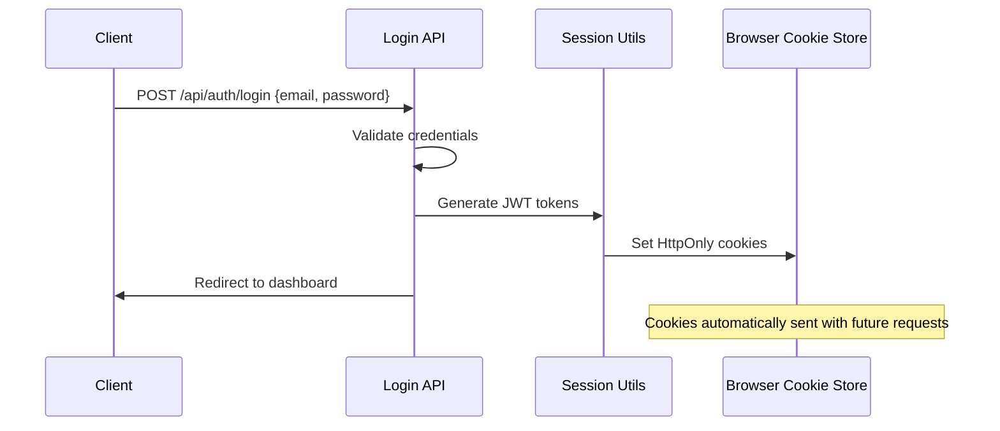

# ADR-0001: Authentication Storage using HttpOnly Cookies

**Status**: ✅ Implemented
**Date**: January 16, 2025
**Decision Makers**: Development Team
**Consulted**: Security Team
**Informed**: Product Team

## Context

The secure member area requires a robust authentication storage mechanism that protects against common web vulnerabilities while maintaining good user experience. The application needs to store JWT tokens securely and handle token refresh automatically.

### Problem Statement

- Need secure storage for JWT authentication tokens
- Protect against XSS (Cross-Site Scripting) attacks
- Prevent CSRF (Cross-Site Request Forgery) vulnerabilities
- Maintain seamless user experience with automatic token refresh
- Support server-side rendering with authentication

### Constraints

- Must work with Next.js 15 App Router
- Need server-side access to authentication state
- Must support automatic token refresh
- Comply with modern security standards

## Decision

**We will use HttpOnly cookies for authentication token storage.**

### Implementation Details

```typescript
// Cookie configuration
const cookieConfig = {
  httpOnly: true, // Prevent JavaScript access
  secure: process.env.NODE_ENV === "production", // HTTPS only in production
  sameSite: "strict" as const, // CSRF protection
  path: "/", // Available across entire app
  maxAge: 15 * 60, // 15 minutes for access token
  expires: tokenExpiry, // Sync with JWT expiration
};
```

### Token Structure

- **Access Token**: 15-minute expiry, path: `/`
- **Refresh Token**: 7-day expiry, path: `/api/auth/refresh`
- **JWT Claims**: `{userId, exp, iat, jti}`

## Rationale

### Why HttpOnly Cookies?

1. **XSS Protection**: JavaScript cannot access HttpOnly cookies, preventing token theft
2. **Automatic Inclusion**: Browser automatically sends cookies with requests
3. **Server-Side Access**: Next.js can read cookies during SSR
4. **CSRF Protection**: SameSite=Strict prevents cross-site requests

### Why Not Alternatives?

| Storage Method       | Pros                        | Cons                      | Decision        |
| -------------------- | --------------------------- | ------------------------- | --------------- |
| **localStorage**     | Simple, large capacity      | Vulnerable to XSS         | ❌ Rejected     |
| **sessionStorage**   | Tab-scoped, simple          | Vulnerable to XSS, no SSR | ❌ Rejected     |
| **In-Memory**        | Secure from XSS             | Lost on page refresh      | ❌ Rejected     |
| **HttpOnly Cookies** | XSS protection, SSR support | Limited size, CSRF risk   | ✅ **Selected** |

## Implementation

### Cookie Management

```typescript
// Setting authentication cookies
export async function setAccessCookie(token: string): Promise<void> {
  const cookieStore = await cookies();
  const payload = await decryptAccessToken(token);
  const expiresAt = payload?.exp ? new Date(payload.exp * 1000) : undefined;

  cookieStore.set(ACCESS_TOKEN_COOKIE, token, {
    httpOnly: true,
    sameSite: "strict",
    secure: process.env.NODE_ENV === "production",
    path: "/",
    expires: expiresAt,
    maxAge: 15 * 60, // 15 minutes
  });
}

export async function setRefreshCookie(token: string): Promise<void> {
  const cookieStore = await cookies();
  const payload = await decryptRefreshToken(token);
  const expiresAt = payload?.exp ? new Date(payload.exp * 1000) : undefined;

  cookieStore.set(REFRESH_TOKEN_COOKIE, token, {
    httpOnly: true,
    sameSite: "strict",
    secure: process.env.NODE_ENV === "production",
    path: "/api/auth/refresh", // Restricted to refresh endpoint
    expires: expiresAt,
    maxAge: 7 * 24 * 60 * 60, // 7 days
  });
}
```

### Authentication Flow



### Cookie Path Strategy

| Token Type        | Path                | Rationale                           |
| ----------------- | ------------------- | ----------------------------------- |
| **Access Token**  | `/`                 | Available throughout application    |
| **Refresh Token** | `/api/auth/refresh` | Restricted to refresh endpoint only |

### Security Configuration

```typescript
// Environment-specific security settings
const securityConfig = {
  development: {
    secure: false, // Allow HTTP for localhost
    sameSite: "lax", // More permissive for dev tools
  },
  production: {
    secure: true, // Require HTTPS
    sameSite: "strict", // Maximum CSRF protection
    domain: ".yourdomain.com", // Domain restriction
  },
};
```

## Consequences

### Positive Consequences

1. **Enhanced Security**
   - Protection against XSS token theft
   - Automatic CSRF mitigation with SameSite
   - No client-side token handling required

2. **Improved Developer Experience**
   - Automatic cookie inclusion in requests
   - Server-side access for SSR
   - Simple token refresh handling

3. **User Experience Benefits**
   - Persistent authentication across browser restarts
   - Seamless token refresh
   - No manual token management

### Negative Consequences

1. **Cookie Limitations**
   - 4KB size limit per cookie
   - Can't be accessed by JavaScript for debugging
   - Browser cookie limits (4096 cookies total)

2. **Deployment Complexity**
   - Requires HTTPS for secure flag
   - Domain configuration for production
   - Cookie path management

3. **Debugging Challenges**
   - Harder to inspect token contents
   - Cannot log tokens for debugging
   - Browser dev tools required for inspection

### Mitigations

| Risk                     | Mitigation                                     |
| ------------------------ | ---------------------------------------------- |
| **Cookie Size Limits**   | Minimal JWT payload, separate refresh token    |
| **Debugging Difficulty** | Server-side logging, browser dev tools         |
| **HTTPS Requirement**    | Development proxy, production SSL/TLS          |
| **CSRF Attacks**         | SameSite=Strict, CSRF tokens for state changes |

## Monitoring and Validation

### Security Metrics

- Authentication bypass attempts
- Cookie manipulation detection
- Cross-site request monitoring
- Token expiration handling

### Performance Metrics

- Cookie processing time
- Token refresh success rate
- Authentication flow completion time

### Testing Strategy

#### Unit Tests

```typescript
describe("Cookie Authentication", () => {
  test("should set HttpOnly cookie with correct flags", () => {
    // Test cookie configuration
  });

  test("should handle token expiration synchronization", () => {
    // Test expiry alignment
  });

  test("should restrict refresh token path", () => {
    // Test path-based restrictions
  });
});
```

#### Integration Tests

```typescript
describe("Authentication Flow", () => {
  test("should authenticate with valid credentials", () => {
    // Test login flow
  });

  test("should refresh tokens automatically", () => {
    // Test refresh mechanism
  });

  test("should handle token expiration", () => {
    // Test expiry handling
  });
});
```

#### Security Tests

```typescript
describe("Security Validation", () => {
  test("should prevent JavaScript access to HttpOnly cookies", () => {
    // Test XSS protection
  });

  test("should reject cross-site requests", () => {
    // Test CSRF protection
  });

  test("should enforce secure flag in production", () => {
    // Test HTTPS requirement
  });
});
```

## How to Test

### Manual Testing

1. **Login Flow**

   ```bash
   # Test successful authentication
   curl -X POST http://localhost:3004/api/auth/login \
     -H "Content-Type: application/json" \
     -d '{"email":"teste@email.com","password":"123456"}' \
     -c cookies.txt -v
   ```

2. **Cookie Inspection**

   ```bash
   # Verify cookie flags
   cat cookies.txt
   # Should show HttpOnly, Secure (prod), SameSite=Strict
   ```

3. **Automatic Token Refresh**
   ```bash
   # Test protected endpoint with expired token
   curl -X GET http://localhost:3004/api/user-profile \
     -b cookies.txt -v
   # Should trigger automatic refresh
   ```

### Browser Testing

1. Open Network tab in dev tools
2. Complete login flow
3. Verify Set-Cookie headers contain proper flags
4. Confirm cookies are marked as HttpOnly in Application tab
5. Test automatic refresh on protected routes

### Security Testing

1. **XSS Prevention**: Attempt `document.cookie` access - should not see HttpOnly cookies
2. **CSRF Protection**: Make cross-origin requests - should be blocked by SameSite
3. **Token Manipulation**: Modify cookie values - should result in authentication failure

## Open Questions

1. **Cookie Domain Strategy**: How will subdomain authentication work?
2. **Multi-Tab Behavior**: How should token refresh work across multiple tabs?
3. **Mobile App Support**: Will mobile clients use different authentication?
4. **Token Revocation**: How will server-side token revocation work?

## Future Considerations

1. **Enhanced Security**
   - Double-submit cookie pattern for CSRF
   - Content Security Policy headers
   - Token binding to specific browser fingerprints

2. **Performance Optimization**
   - Cookie compression for large payloads
   - Efficient token refresh batching
   - Client-side token expiry prediction

3. **Operational Improvements**
   - Centralized session management
   - Token analytics and monitoring
   - Automated security audits

---

**Implementation Files**:

- `src/shared/libs/session/index.ts` - Cookie management utilities
- `src/app/api/auth/login/route.ts` - Authentication endpoint
- `src/app/api/auth/refresh/route.ts` - Token refresh endpoint

**Related ADRs**:

- [ADR-0002](./0002-protected-ssr-dashboard-middleware-vs-handler.md) - SSR authentication
- [ADR-0006](./0006-csrf-and-state-changing-requests.md) - CSRF protection
