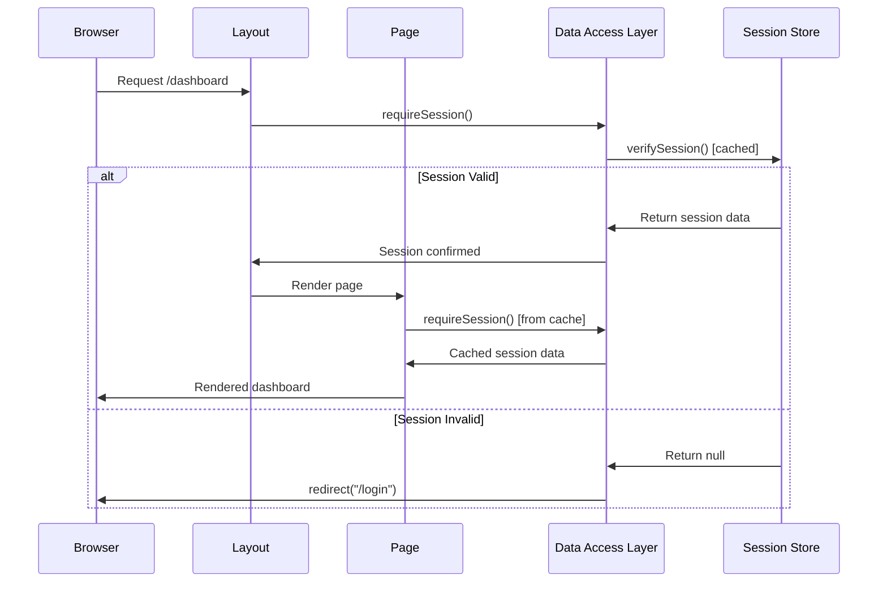

# ADR-0002: Protected SSR Dashboard - Middleware vs Handler Approach

**Status**: ✅ Implemented
**Date**: January 16, 2025
**Decision Makers**: Development Team
**Consulted**: Security Team, Performance Team
**Informed**: Product Team

## Context

The secure member area requires server-side rendered (SSR) protected routes that ensure authenticated access while maintaining optimal performance. The dashboard must verify user authentication before rendering any sensitive content, preventing unauthorized access and information leakage.

### Problem Statement

- Need server-side authentication verification for sensitive routes
- Prevent unauthorized access to protected content
- Maintain SEO benefits and performance of SSR
- Handle authentication failures gracefully
- Support both page-level and API-level protection

### Constraints

- Must work with Next.js 15 App Router
- Need consistent authentication across pages and APIs
- Must prevent flash of unauthorized content
- Should maintain good Core Web Vitals scores

## Decision

**We will implement a Data Access Layer (DAL) pattern with separate functions for pages (`requireSession`) and APIs (`ensureSession`) rather than relying solely on middleware.**

### Implementation Architecture

```mermaid
graph TB
    subgraph "Request Flow"
        Request[Incoming Request]
        Middleware[Auth Middleware]
        Layout[Private Layout]
        Page[Protected Page]
        API[API Route]
    end

    subgraph "DAL Layer"
        RequireSession[requireSession()]
        EnsureSession[ensureSession()]
        VerifySession[verifySession()]
        Cache[React.cache()]
    end

    subgraph "Session Management"
        Cookies[HttpOnly Cookies]
        JWT[JWT Verification]
        Redirect[Redirect Logic]
    end

    Request --> Middleware
    Middleware --> Layout
    Layout --> RequireSession
    RequireSession --> VerifySession
    VerifySession --> Cache
    Cache --> JWT
    JWT --> Cookies

    Request --> API
    API --> EnsureSession
    EnsureSession --> VerifySession

    RequireSession --> Redirect
```

## Rationale

### Why DAL Pattern Over Pure Middleware?

| Approach            | Pages       | APIs        | Flexibility | Performance    | Maintainability    |
| ------------------- | ----------- | ----------- | ----------- | -------------- | ------------------ |
| **Pure Middleware** | ✅ Global   | ✅ Global   | ❌ Limited  | ✅ Fast        | ❌ Complex routing |
| **Route Guards**    | ✅ Flexible | ✅ Flexible | ✅ High     | ❌ N+1 queries | ❌ Scattered logic |
| **DAL Pattern**     | ✅ Optimal  | ✅ Optimal  | ✅ High     | ✅ Cached      | ✅ Centralized     |

### Core Decision Factors

1. **Separation of Concerns**: Different contexts require different behaviors
   - Pages need redirects for better UX
   - APIs need 401 responses for proper error handling

2. **Performance Optimization**: React.cache() prevents duplicate session checks
3. **Developer Experience**: Clear, type-safe authentication utilities
4. **Security**: Centralized validation logic reduces security gaps

## Implementation

### Data Access Layer Structure

```typescript
// src/shared/libs/dal/index.ts
import "server-only";
import { cache } from "react";
import { redirect } from "next/navigation";

export interface SessionData {
  userId: string;
  email?: string;
  exp: number;
}

// Core session verification (cached)
export const verifySession = cache(async (): Promise<SessionData | null> => {
  const accessToken = await getAccessToken();

  if (!accessToken) {
    return null;
  }

  const payload = await decryptAccessToken(accessToken);
  if (!payload) {
    // Try refresh if access token invalid
    const refreshed = await refreshTokensServerSide();
    if (refreshed) {
      const newAccessToken = await getAccessToken();
      return newAccessToken ? await decryptAccessToken(newAccessToken) : null;
    }
    return null;
  }

  return {
    userId: payload.userId,
    email: payload.email,
    exp: payload.exp,
  };
});

// For pages - redirects if unauthorized
export async function requireSession(): Promise<SessionData> {
  const session = await verifySession();
  if (!session) {
    redirect("/login");
  }
  return session;
}

// For APIs - returns null if unauthorized
export async function ensureSession(): Promise<SessionData | null> {
  return await verifySession();
}
```

### Protected Layout Implementation

```typescript
// src/app/(private)/layout.tsx
import { requireSession } from "@/shared/libs/dal";

export default async function PrivateLayout({
  children,
}: {
  children: React.ReactNode;
}) {
  // This call is cached across the request
  await requireSession();

  return (
    <div className="min-h-screen bg-background">
      {/* Layout content */}
      {children}
    </div>
  );
}
```

### Protected Page Implementation

```typescript
// src/app/(private)/dashboard/page.tsx
import { requireSession } from "@/shared/libs/dal";
import { getUserProfile } from "@/shared/libs/dal";

export default async function DashboardPage() {
  // Cached session check
  const session = await requireSession();

  // Fetch user data using authenticated session
  const userProfile = await getUserProfile(session.userId);

  return (
    <DashboardScreen userProfile={userProfile} />
  );
}
```

### Protected API Implementation

```typescript
// src/app/api/user-profile/route.ts
import { ensureSession } from "@/shared/libs/dal";

export async function GET() {
  const session = await ensureSession();

  if (!session) {
    return NextResponse.json({ message: "Unauthorized" }, { status: 401 });
  }

  // Fetch and return user data
  const userData = await getUserData(session.userId);
  return NextResponse.json(userData);
}
```

### Authentication Flow Diagram



## Consequences

### Positive Consequences

1. **Performance Benefits**
   - React.cache() eliminates duplicate session checks
   - Single database/token verification per request
   - Efficient SSR rendering with authentication

2. **Developer Experience**
   - Clear separation between page and API authentication
   - Type-safe session data throughout application
   - Consistent authentication patterns

3. **Security Advantages**
   - Centralized authentication logic
   - No client-side authentication state exposure
   - Automatic redirect handling for unauthorized access

4. **Maintainability**
   - Single source of truth for authentication
   - Easy to modify authentication requirements
   - Clear testing patterns

### Negative Consequences

1. **Complexity**
   - Additional abstraction layer to understand
   - Multiple authentication functions to maintain
   - Cache invalidation considerations

2. **Debugging Challenges**
   - React.cache() can obscure multiple calls
   - Session state not immediately visible in components
   - Server-side only debugging required

### Risk Mitigation

| Risk                       | Impact | Mitigation                                      |
| -------------------------- | ------ | ----------------------------------------------- |
| **Cache Stale Data**       | Medium | Short cache lifetime, request-scoped caching    |
| **Performance Regression** | Low    | Cached session checks, efficient JWT validation |
| **Security Bypass**        | High   | Centralized validation, comprehensive testing   |
| **Developer Confusion**    | Medium | Clear documentation, consistent naming          |

## Authentication Patterns

### Page Authentication Pattern

```typescript
// Always redirects unauthorized users
export default async function ProtectedPage() {
  const session = await requireSession(); // Never returns null

  // Safe to use session data
  return <div>Welcome {session.email}</div>;
}
```

### API Authentication Pattern

```typescript
// Returns 401 for unauthorized requests
export async function GET() {
  const session = await ensureSession(); // May return null

  if (!session) {
    return NextResponse.json({ error: "Unauthorized" }, { status: 401 });
  }

  // Proceed with authenticated logic
}
```

### Mixed Authentication Pattern

```typescript
// Component that works in both contexts
async function UserData() {
  const session = await verifySession(); // Core verification

  if (!session) {
    return <LoginPrompt />;
  }

  return <UserInfo user={session} />;
}
```

## Performance Considerations

### Caching Strategy

- **Request-scoped caching**: React.cache() ensures single verification per request
- **Token validation**: JWT verification happens once per request
- **Database queries**: Cached session data prevents repeated user lookups

### Core Web Vitals Impact

- **LCP**: Faster rendering with cached session checks
- **CLS**: No layout shift from authentication loading states
- **FID**: Immediate interactivity with SSR content

### Monitoring Metrics

```typescript
// Performance tracking
const performanceMetrics = {
  sessionVerificationTime: "<10ms",
  cacheHitRate: ">95%",
  authenticationRedirectTime: "<100ms",
  apiAuthenticationTime: "<5ms",
};
```

## Testing Strategy

### Unit Tests

```typescript
describe("Data Access Layer", () => {
  test("requireSession redirects when session invalid", async () => {
    // Mock invalid session
    // Verify redirect called
  });

  test("ensureSession returns null when session invalid", async () => {
    // Mock invalid session
    // Verify null returned
  });

  test("verifySession caches results", async () => {
    // Verify cache behavior
  });
});
```

### Integration Tests

```typescript
describe("Protected Routes", () => {
  test("dashboard redirects unauthorized users", async () => {
    // Test unauthorized access
  });

  test("API returns 401 for unauthorized requests", async () => {
    // Test API authentication
  });

  test("session refresh works transparently", async () => {
    // Test token refresh flow
  });
});
```

### Performance Tests

```typescript
describe("Authentication Performance", () => {
  test("session verification completes under 10ms", async () => {
    // Performance benchmark
  });

  test("cache prevents duplicate verifications", async () => {
    // Cache efficiency test
  });
});
```

## How to Test

### Manual Testing

1. **Authenticated Access**

   ```bash
   # Login first
   curl -X POST http://localhost:3004/api/auth/login \
     -H "Content-Type: application/json" \
     -d '{"email":"teste@email.com","password":"123456"}' \
     -c cookies.txt

   # Access protected page
   curl -X GET http://localhost:3004/dashboard \
     -b cookies.txt -L -v
   # Should return dashboard content
   ```

2. **Unauthorized Access**

   ```bash
   # Access without authentication
   curl -X GET http://localhost:3004/dashboard -L -v
   # Should redirect to login
   ```

3. **API Authentication**
   ```bash
   # Test protected API
   curl -X GET http://localhost:3004/api/user-profile \
     -b cookies.txt -v
   # Should return user data or 401
   ```

### Browser Testing

1. Navigate to `/dashboard` without logging in → Should redirect to `/login`
2. Login with valid credentials → Should access dashboard
3. Clear cookies and refresh dashboard → Should redirect to login
4. Test API endpoints in Network tab → Verify proper authentication

### Performance Testing

1. Use React DevTools Profiler to measure render times
2. Monitor Network tab for duplicate authentication requests
3. Verify single session verification per page load

## Open Questions

1. **Session Refresh Timing**: When should automatic token refresh occur?
2. **Multi-tab Behavior**: How should session expiry work across tabs?
3. **Error Recovery**: Should failed authentication attempts be retried?
4. **Cache Invalidation**: When should session cache be manually invalidated?

## Future Considerations

1. **Advanced Caching**
   - Redis-based session storage for horizontal scaling
   - Distributed cache invalidation strategies
   - Session sharing across multiple applications

2. **Enhanced Security**
   - Session fingerprinting and device tracking
   - Anomaly detection for authentication patterns
   - Advanced rate limiting and abuse prevention

3. **Performance Optimization**
   - Edge-cached authentication verification
   - Predictive session refresh
   - Optimized token validation algorithms

---

**Implementation Files**:

- `src/shared/libs/dal/index.ts` - Data Access Layer
- `src/app/(private)/layout.tsx` - Protected layout implementation
- `src/app/api/*/route.ts` - Protected API endpoints

**Related ADRs**:

- [ADR-0001](./0001-auth-storage-httpOnly-cookies.md) - Cookie storage mechanism
- [ADR-0003](./0003-client-fetch-auth-pattern.md) - Client-side authentication
