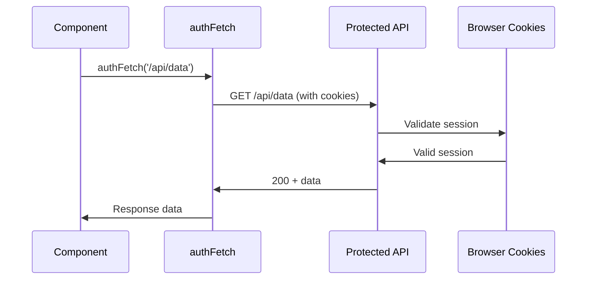
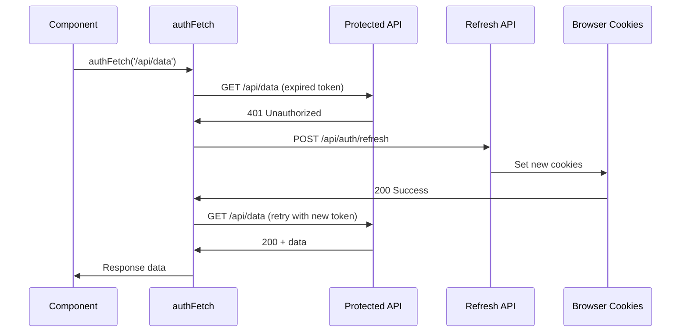

# ADR-0003: Client Fetch Authentication Pattern

**Status**: ✅ Implemented
**Date**: January 16, 2025
**Decision Makers**: Frontend Team, Security Team
**Consulted**: Backend Team
**Informed**: Product Team

## Context

Client-side components need to make authenticated API requests while handling token expiration, refresh logic, and error scenarios gracefully. The authentication system uses HttpOnly cookies, but client-side code needs robust patterns for handling authentication failures and automatic token refresh.

### Problem Statement
- Client components need to make authenticated API calls
- Handle token expiration transparently for users
- Implement retry logic for failed authentication
- Provide consistent error handling across components
- Integrate seamlessly with React Query for state management

### Constraints
- Cannot access HttpOnly cookies from JavaScript
- Must handle 401 responses gracefully
- Need automatic token refresh without user intervention
- Should work with existing React Query setup
- Must provide good user feedback during auth failures

## Decision

**We will implement a custom `authFetch` wrapper that handles authentication, token refresh, and error scenarios automatically, integrated with React Query for data management.**

### Core Implementation

```typescript
// Auth fetch wrapper with automatic retry and refresh
export async function authFetch(
  url: string,
  options: AuthFetchOptions = {}
): Promise<Response> {
  const defaultOptions: RequestInit = {
    credentials: "include", // Include HttpOnly cookies
    headers: {
      "Content-Type": "application/json",
      ...(options.headers as Record<string, string>),
    },
  };

  const mergedOptions = { ...defaultOptions, ...options };

  let response = await fetch(url, mergedOptions);

  // Handle 401 with automatic token refresh
  if (response.status === 401) {
    const refreshResponse = await fetch("/api/auth/refresh", {
      method: "POST",
      credentials: "include",
    });

    if (refreshResponse.ok) {
      // Retry original request after successful refresh
      response = await fetch(url, mergedOptions);

      if (response.status === 401) {
        // Still unauthorized after refresh - redirect to login
        window.location.href = "/login";
      }
    } else {
      // Refresh failed - redirect to login
      window.location.href = "/login";
    }
  }

  return response;
}
```

## Rationale

### Why Custom Auth Fetch?

| Approach | Auto-Retry | Token Refresh | Error Handling | Integration | Decision |
|----------|------------|---------------|----------------|-------------|----------|
| **Native fetch** | ❌ Manual | ❌ Manual | ❌ Manual | ✅ Universal | ❌ Too basic |
| **Axios interceptors** | ✅ Built-in | ✅ Configurable | ✅ Good | ❌ Bundle size | ❌ Overhead |
| **SWR auth** | ✅ Built-in | ❌ Manual | ✅ Good | ✅ React | 🔄 Alternative |
| **Custom authFetch** | ✅ Tailored | ✅ Automatic | ✅ Complete | ✅ Flexible | ✅ **Selected** |

### Key Decision Factors

1. **Simplicity**: Single wrapper function, minimal API surface
2. **Transparency**: Automatic token refresh without user awareness
3. **Integration**: Works seamlessly with React Query
4. **Control**: Full control over retry logic and error handling
5. **Performance**: No additional bundle overhead

## Implementation

### AuthFetch Core Logic

```mermaid
flowchart TD
    Start[Client Request] --> Fetch[authFetch(url, options)]
    Fetch --> Request[Make HTTP Request]
    Request --> Check{Status Code?}

    Check -->|200-299| Success[Return Response]
    Check -->|401| Refresh[Attempt Token Refresh]
    Check -->|Other| Error[Handle Error]

    Refresh --> RefreshReq[POST /api/auth/refresh]
    RefreshReq --> RefreshCheck{Refresh Success?}

    RefreshCheck -->|Yes| Retry[Retry Original Request]
    RefreshCheck -->|No| Login[Redirect to Login]

    Retry --> RetryCheck{Retry Success?}
    RetryCheck -->|Yes| Success
    RetryCheck -->|No| Login

    Success --> End[Response to Component]
    Error --> End
    Login --> End
```

### React Query Integration

```typescript
// Custom hook with authFetch integration
export function useRecentActivities(params?: { limit?: number }) {
  return useQuery({
    queryKey: ['recent-activities', params],
    queryFn: async () => {
      const searchParams = new URLSearchParams();
      if (params?.limit) {
        searchParams.set('limit', params.limit.toString());
      }

      const response = await authFetch(
        `/api/recent-activities?${searchParams}`
      );

      if (!response.ok) {
        throw new Error('Failed to fetch activities');
      }

      return response.json();
    },
    retry: (failureCount, error) => {
      // Don't retry auth failures (already handled by authFetch)
      if (error.message.includes('401') || error.message.includes('Unauthorized')) {
        return false;
      }
      return failureCount < 3;
    },
    staleTime: 5 * 60 * 1000, // 5 minutes
    cacheTime: 10 * 60 * 1000, // 10 minutes
  });
}
```

### Enhanced Error Handling

```typescript
export async function authFetch(
  url: string,
  options: AuthFetchOptions = {}
): Promise<Response> {
  try {
    // Add Sentry breadcrumb for debugging
    Sentry.addBreadcrumb({
      message: "Making authenticated client request",
      category: "http",
      level: "info",
      data: { url, method: options.method || "GET" },
    });

    const response = await fetch(url, mergedOptions);

    if (response.status === 401) {
      Sentry.addBreadcrumb({
        message: "Received 401, attempting client-side token refresh",
        category: "auth",
        level: "info",
        data: { originalUrl: url },
      });

      const refreshResponse = await fetch("/api/auth/refresh", {
        method: "POST",
        credentials: "include",
      });

      if (refreshResponse.ok) {
        const retryResponse = await fetch(url, mergedOptions);

        if (retryResponse.status === 401) {
          Sentry.captureMessage("Request still unauthorized after token refresh", {
            level: "warning",
            extra: { url, method: options.method || "GET" },
          });

          if (typeof window !== "undefined") {
            window.location.href = "/login";
          }
        }

        return retryResponse;
      } else {
        Sentry.captureMessage("Client token refresh failed, redirecting to login", {
          level: "warning",
          extra: {
            refreshStatus: refreshResponse.status,
            originalUrl: url,
          },
        });

        if (typeof window !== "undefined") {
          window.location.href = "/login";
        }
      }
    }

    return response;
  } catch (error) {
    Sentry.captureException(error, {
      tags: { component: "auth-fetch" },
      extra: { url, method: options.method || "GET" },
    });
    throw error;
  }
}
```

### Component Usage Pattern

```typescript
// Component using authenticated data
export function RecentActivities() {
  const { data, isLoading, error, refetch } = useRecentActivities({ limit: 8 });
  const { announce } = useScreenReaderAnnouncement();

  const refreshMutation = useMutation({
    mutationFn: async () => {
      const response = await authFetch('/api/recent-activities/refresh', {
        method: 'POST'
      });

      if (!response.ok) {
        throw new Error('Failed to refresh activities');
      }

      return response.json();
    },
    onSuccess: () => {
      announce("Activities refreshed successfully", "polite");
      refetch(); // Refresh React Query cache
    },
    onError: (error) => {
      announce("Failed to refresh activities", "assertive");
      console.error('Refresh failed:', error);
    }
  });

  if (isLoading) return <LoadingSkeleton />;
  if (error) return <ErrorDisplay error={error} onRetry={() => refetch()} />;

  return (
    <div>
      <Button onClick={() => refreshMutation.mutate()}>
        {refreshMutation.isPending ? "Refreshing..." : "Refresh"}
      </Button>
      <ActivitiesList activities={data?.activities} />
    </div>
  );
}
```

## Consequences

### Positive Consequences

1. **Seamless User Experience**
   - Transparent token refresh without user interruption
   - Consistent loading states across components
   - Graceful error handling with user feedback

2. **Developer Experience**
   - Simple API similar to native fetch
   - Automatic authentication handling
   - Easy integration with existing React Query setup
   - Clear error messages for debugging

3. **Security Benefits**
   - No client-side token management
   - Automatic logout on authentication failure
   - Secure cookie handling through browser

4. **Performance**
   - No additional bundle overhead
   - Efficient retry logic
   - React Query caching benefits

### Negative Consequences

1. **Browser Dependency**
   - Requires browser environment for redirects
   - Cannot be used in Node.js/SSR contexts
   - Window object dependency for redirects

2. **Limited Customization**
   - Fixed retry logic for auth failures
   - Hardcoded redirect behavior
   - Cannot easily mock for testing

3. **Error Handling Complexity**
   - Multiple error scenarios to handle
   - Network vs authentication error distinction
   - Debugging can be complex with automatic retries

### Risk Mitigation

| Risk | Impact | Mitigation |
|------|---------|------------|
| **Infinite Refresh Loops** | High | Single retry limit, timeout handling |
| **Race Conditions** | Medium | Request queuing, debounced refreshes |
| **Error Masking** | Medium | Comprehensive Sentry logging |
| **Testing Complexity** | Low | Mock authFetch in tests |

## Authentication Flow Examples

### Successful Request Flow


### Token Refresh Flow


## Testing Strategy

### Unit Tests
```typescript
describe('authFetch', () => {
  beforeEach(() => {
    jest.clearAllMocks();
    global.fetch = jest.fn();
  });

  test('should include credentials in requests', async () => {
    const mockResponse = { ok: true, status: 200, json: () => ({}) };
    (global.fetch as jest.Mock).mockResolvedValueOnce(mockResponse);

    await authFetch('/api/test');

    expect(global.fetch).toHaveBeenCalledWith('/api/test',
      expect.objectContaining({
        credentials: 'include'
      })
    );
  });

  test('should attempt token refresh on 401', async () => {
    const unauthorizedResponse = { ok: false, status: 401 };
    const refreshResponse = { ok: true, status: 200 };
    const retryResponse = { ok: true, status: 200, json: () => ({}) };

    (global.fetch as jest.Mock)
      .mockResolvedValueOnce(unauthorizedResponse)  // Initial request
      .mockResolvedValueOnce(refreshResponse)       // Refresh request
      .mockResolvedValueOnce(retryResponse);        // Retry request

    await authFetch('/api/test');

    expect(global.fetch).toHaveBeenCalledTimes(3);
    expect(global.fetch).toHaveBeenNthCalledWith(2, '/api/auth/refresh',
      expect.objectContaining({
        method: 'POST',
        credentials: 'include'
      })
    );
  });

  test('should redirect to login on refresh failure', async () => {
    delete (window as any).location;
    (window as any).location = { href: '' };

    const unauthorizedResponse = { ok: false, status: 401 };
    const refreshFailure = { ok: false, status: 401 };

    (global.fetch as jest.Mock)
      .mockResolvedValueOnce(unauthorizedResponse)
      .mockResolvedValueOnce(refreshFailure);

    await authFetch('/api/test');

    expect(window.location.href).toBe('/login');
  });
});
```

### Integration Tests
```typescript
describe('React Query + authFetch Integration', () => {
  test('should retry failed requests automatically', async () => {
    // Test React Query retry behavior with authFetch
  });

  test('should handle authentication errors gracefully', async () => {
    // Test error boundaries with auth failures
  });

  test('should refresh data after successful auth refresh', async () => {
    // Test data refetching after token refresh
  });
});
```

### Manual Testing
```bash
# Test authenticated request
curl -X GET http://localhost:3004/api/recent-activities \
  -b cookies.txt -v

# Test with expired token (modify cookie expiry)
# Should trigger automatic refresh

# Test with invalid token (corrupt cookie)
# Should redirect to login
```

## How to Test

### Browser Testing
1. **Login and Access Data**
   - Login with valid credentials
   - Navigate to dashboard
   - Verify data loads without errors

2. **Token Expiration Testing**
   - Login and wait for token expiry (or manually expire)
   - Trigger a data refresh
   - Verify automatic token refresh works

3. **Authentication Failure Testing**
   - Clear authentication cookies
   - Attempt to refresh data
   - Verify redirect to login page

4. **Network Error Testing**
   - Use dev tools to simulate network failures
   - Verify appropriate error handling
   - Test retry behavior

### Performance Testing
1. **Load Testing**: Measure performance impact of auth wrapper
2. **Memory Testing**: Verify no memory leaks from retry logic
3. **Bundle Analysis**: Confirm no significant bundle size increase

## Open Questions

1. **Request Queuing**: Should multiple concurrent requests wait for refresh?
2. **Retry Configuration**: Should retry counts/delays be configurable?
3. **Error Reporting**: What level of error detail should be exposed?
4. **SSR Compatibility**: How can this pattern work with SSR?

## Future Considerations

1. **Request Queuing**
   - Queue concurrent requests during token refresh
   - Prevent multiple simultaneous refresh attempts
   - Batch failed requests for retry after refresh

2. **Advanced Error Handling**
   - Configurable retry strategies per endpoint
   - Circuit breaker pattern for failing APIs
   - Exponential backoff for retries

3. **Performance Optimization**
   - Predictive token refresh before expiry
   - Request deduplication
   - Intelligent caching strategies

4. **Enhanced Security**
   - Request signing for additional security
   - Token fingerprinting
   - Advanced threat detection

---

**Implementation Files**:
- `src/modules/auth/utils/auth-fetch.ts` - Core authFetch implementation
- `src/modules/dashboard/hooks/use-recent-activities.ts` - React Query integration
- `src/modules/dashboard/components/recent-activities/index.tsx` - Component usage

**Related ADRs**:
- [ADR-0001](./0001-auth-storage-httpOnly-cookies.md) - HttpOnly cookie storage
- [ADR-0007](./0007-error-handling-and-retry-strategy.md) - Error handling patterns