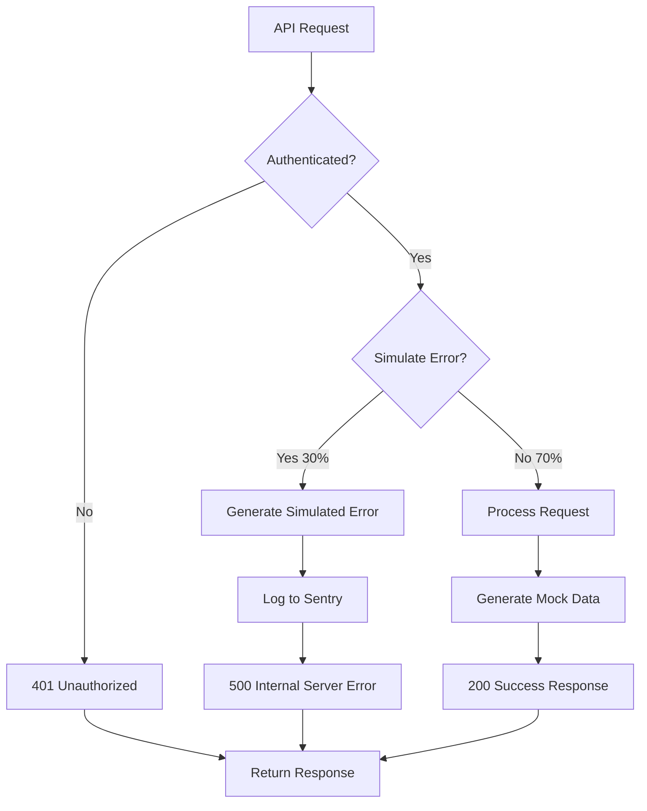

# ADR-0004: API Mocks with Route Handlers

**Status**: ✅ Implemented
**Date**: January 16, 2025
**Decision Makers**: Development Team
**Consulted**: Backend Team
**Informed**: Product Team

## Context

The secure member area MVP requires realistic API endpoints for demonstrating authentication patterns, data fetching, and error handling without a full backend implementation. The mock APIs must integrate seamlessly with Next.js App Router and provide realistic data and error scenarios.

### Problem Statement

- Need realistic API endpoints for dashboard functionality
- Demonstrate authentication validation in API routes
- Provide consistent mock data for development and testing
- Simulate error scenarios for observability testing
- Support rapid prototyping without backend dependency

### Constraints

- Must integrate with Next.js 15 App Router Route Handlers
- Should validate authentication using existing session management
- Need to simulate realistic data structures
- Must support error simulation for Sentry testing

## Decision

**We will implement mock APIs using Next.js Route Handlers with authentication validation and configurable error simulation.**

### Core Architecture

```typescript
// API Route Handler Pattern
export async function GET(request: NextRequest) {
  try {
    // Authentication validation
    const session = await ensureSession();
    if (!session) {
      return NextResponse.json({ message: "Unauthorized" }, { status: 401 });
    }

    // Error simulation for testing
    if (shouldSimulateError()) {
      throw new SimulatedError("Mock database connection failed");
    }

    // Generate mock data
    const data = generateMockData(session.userId);
    return NextResponse.json(data);
  } catch (error) {
    // Error tracking
    Sentry.captureException(error);
    return NextResponse.json(
      { error: "Internal server error" },
      { status: 500 }
    );
  }
}
```

## Rationale

### Why Route Handlers Over Alternatives?

| Approach                      | Integration         | Auth Support | Error Simulation | Scalability  | Decision                 |
| ----------------------------- | ------------------- | ------------ | ---------------- | ------------ | ------------------------ |
| **MSW (Mock Service Worker)** | ❌ Complex          | ❌ Limited   | ✅ Good          | ✅ Excellent | ❌ Over-engineering      |
| **JSON Server**               | ❌ Separate process | ❌ None      | ❌ Limited       | ❌ Poor      | ❌ Too simple            |
| **Express Mock Server**       | ❌ Separate stack   | ✅ Custom    | ✅ Good          | ✅ Good      | ❌ Additional complexity |
| **Next.js Route Handlers**    | ✅ Native           | ✅ Built-in  | ✅ Full control  | ✅ Excellent | ✅ **Selected**          |

### Key Decision Factors

1. **Native Integration**: Perfect fit with Next.js App Router
2. **Authentication**: Reuses existing session management
3. **Development Speed**: No additional setup required
4. **Error Simulation**: Full control over error scenarios
5. **Observability**: Direct Sentry integration

## Implementation

### API Contracts

#### User Profile Endpoint

```typescript
// GET /api/user-profile
interface UserProfileResponse {
  id: string;
  name: string;
  email: string;
  avatar?: string;
  createdAt: string;
  lastLogin: string;
}
```

#### Recent Activities Endpoint

```typescript
// GET /api/recent-activities?limit=10&offset=0
interface Activity {
  id: string;
  action: string;
  timestamp: string;
  details: string;
  status: "success" | "warning" | "error";
  user: string;
}

interface ActivitiesResponse {
  activities: Activity[];
  total: number;
  hasMore: boolean;
}
```

### Mock Data Generation

```typescript
// Mock data generators
const generateMockActivities = (count: number = 20): Activity[] => {
  const actions = [
    "Fez login",
    "Atualizou perfil",
    "Alterou senha",
    "Fez upload de arquivo",
    "Exportou dados",
  ];

  const statuses: ("success" | "warning" | "error")[] = [
    "success",
    "warning",
    "error",
  ];

  return Array.from({ length: count }, (_, i) => ({
    id: `${i + 1}`,
    action: actions[Math.floor(Math.random() * actions.length)],
    timestamp: new Date(
      Date.now() - Math.random() * 30 * 24 * 60 * 60 * 1000
    ).toISOString(),
    details: `Ação executada com sucesso - ID ${i + 1}`,
    status: statuses[Math.floor(Math.random() * statuses.length)],
    user: `user-${Math.floor(Math.random() * 5) + 1}`,
  })).sort(
    (a, b) => new Date(b.timestamp).getTime() - new Date(a.timestamp).getTime()
  );
};
```

### Error Simulation Strategy

```typescript
// Configurable error simulation
const ERROR_SIMULATION_RATE = 0.3; // 30% chance

const shouldSimulateError = (): boolean => {
  return Math.random() < ERROR_SIMULATION_RATE;
};

const generateSimulatedError = (context: string) => {
  const errors = [
    "Database connection timeout",
    "Service temporarily unavailable",
    "Rate limit exceeded",
    "Invalid request parameters",
  ];

  const error = new Error(errors[Math.floor(Math.random() * errors.length)]);
  error.name = `${context}SimulationError`;
  return error;
};
```

### Complete Route Handler Implementation

```typescript
// src/app/api/recent-activities/route.ts
import { NextRequest, NextResponse } from "next/server";
import { ensureSession } from "@/shared/libs/dal";
import * as Sentry from "@sentry/nextjs";

const MOCK_ACTIVITIES_COUNT = 20;
const ERROR_SIMULATION_THRESHOLD = 0.7; // 30% error rate

export async function GET(request: NextRequest) {
  try {
    // Authentication validation
    const session = await ensureSession();
    if (!session) {
      return NextResponse.json({ message: "Unauthorized" }, { status: 401 });
    }

    // Set user context for Sentry
    Sentry.setUser({
      id: session.userId,
    });

    // Error simulation for observability testing
    const shouldError = Math.random() > ERROR_SIMULATION_THRESHOLD;
    if (shouldError) {
      const simulatedError = new Error(
        "Failed to fetch activities from database - Connection timeout"
      );
      simulatedError.name = "DatabaseTimeoutError";

      Sentry.captureException(simulatedError, {
        tags: {
          component: "api",
          route: "recent-activities",
          error_type: "simulated",
        },
        extra: {
          userId: session.userId,
          simulationThreshold: ERROR_SIMULATION_THRESHOLD,
          wasTriggered: true,
        },
      });

      throw simulatedError;
    }

    // Parse query parameters
    const { searchParams } = new URL(request.url);
    const limit = parseInt(searchParams.get("limit") || "10");
    const offset = parseInt(searchParams.get("offset") || "0");

    // Generate and paginate mock data
    const activities = generateMockActivities();
    const paginatedActivities = activities.slice(offset, offset + limit);

    return NextResponse.json({
      activities: paginatedActivities,
      total: activities.length,
      hasMore: offset + limit < activities.length,
    });
  } catch (error) {
    Sentry.captureException(error, {
      tags: {
        component: "api",
        route: "recent-activities",
      },
      extra: {
        method: request.method,
        url: request.url,
        errorMessage: error instanceof Error ? error.message : String(error),
      },
    });

    return NextResponse.json(
      { error: "Failed to fetch recent activities" },
      { status: 500 }
    );
  }
}
```

## API Testing and Validation

### Manual Testing Scripts

```bash
# Test authentication required
curl -X GET http://localhost:3004/api/user-profile \
  -v
# Expected: 401 Unauthorized

# Test with authentication
curl -X GET http://localhost:3004/api/user-profile \
  -H "Cookie: access_token=valid_token" \
  -v
# Expected: 200 + user data

# Test pagination
curl -X GET "http://localhost:3004/api/recent-activities?limit=5&offset=0" \
  -H "Cookie: access_token=valid_token" \
  -v
# Expected: 200 + paginated activities

# Test error simulation (multiple requests to trigger 30% error rate)
for i in {1..10}; do
  curl -X GET http://localhost:3004/api/recent-activities \
    -H "Cookie: access_token=valid_token" \
    -s -w "%{http_code}\n" -o /dev/null
done
# Expected: Mix of 200 and 500 status codes
```

### Error Simulation Flow



## Consequences

### Positive Consequences

1. **Rapid Development**
   - No backend dependency for frontend development
   - Immediate API availability for testing
   - Easy data structure experimentation

2. **Realistic Testing Environment**
   - Authentic authentication flows
   - Error scenario simulation
   - Observability tool integration

3. **Simplified Architecture**
   - Single codebase for frontend and mock APIs
   - Shared authentication logic
   - Consistent error handling patterns

4. **Enhanced Observability**
   - Real error tracking integration
   - Performance monitoring data
   - User interaction analytics

### Negative Consequences

1. **Limited Realism**
   - No actual database queries
   - Static data relationships
   - Simplified business logic

2. **Maintenance Overhead**
   - Mock data must be kept current
   - Error scenarios need manual configuration
   - No real performance characteristics

3. **Testing Limitations**
   - Cannot test real database constraints
   - No actual network latency
   - Limited error variety

### Migration Considerations

| Aspect             | Mock Implementation  | Real Backend         |
| ------------------ | -------------------- | -------------------- |
| **Authentication** | Session validation   | OAuth/JWT validation |
| **Data Storage**   | In-memory generation | Database queries     |
| **Error Handling** | Simulated errors     | Real system errors   |
| **Performance**    | Instant responses    | Network/DB latency   |

## Mock vs Real Backend Transition

```typescript
// Configuration-based backend switching
const API_CONFIG = {
  development: {
    mode: "mock",
    errorRate: 0.3,
    latency: 0,
  },
  staging: {
    mode: "hybrid", // Some real, some mock
    errorRate: 0.1,
    latency: 100,
  },
  production: {
    mode: "real",
    errorRate: 0.01,
    latency: "variable",
  },
};
```

## How to Test

### Development Testing

1. **Start Development Server**

   ```bash
   npm run dev
   ```

2. **Test Authentication Flow**

   ```bash
   # Login first
   curl -X POST http://localhost:3004/api/auth/login \
     -H "Content-Type: application/json" \
     -d '{"email":"teste@email.com","password":"123456"}' \
     -c cookies.txt

   # Test protected API
   curl -X GET http://localhost:3004/api/user-profile \
     -b cookies.txt -v
   ```

3. **Test Error Simulation**
   ```bash
   # Multiple requests to see error simulation
   for i in {1..20}; do
     curl -X GET http://localhost:3004/api/recent-activities \
       -b cookies.txt -s -w "%{http_code} " -o /dev/null
   done
   echo
   ```

### Integration Testing

```typescript
describe("Mock API Integration", () => {
  test("should require authentication", async () => {
    const response = await fetch("/api/user-profile");
    expect(response.status).toBe(401);
  });

  test("should return user data when authenticated", async () => {
    // Login first, then test API
  });

  test("should simulate errors occasionally", async () => {
    // Multiple requests to trigger error simulation
  });
});
```

## Open Questions

1. **Error Rate Configuration**: Should error simulation be configurable per environment?
2. **Data Persistence**: Should mock data persist across server restarts?
3. **Response Latency**: Should we simulate network delays for realism?
4. **Real Backend Migration**: What's the transition strategy to real APIs?

## Future Enhancements

1. **Enhanced Mock Data**
   - User-specific data generation
   - Relational data consistency
   - Time-series data patterns

2. **Configurable Simulation**
   - Environment-based error rates
   - Configurable response latency
   - A/B testing support

3. **Backend Integration**
   - Gradual migration to real APIs
   - Proxy configuration for mixed environments
   - Feature flags for API switching

---

**Implementation Files**:

- `src/app/api/user-profile/route.ts` - User profile mock API
- `src/app/api/recent-activities/route.ts` - Activities mock API
- `src/app/api/recent-activities/types.ts` - Type definitions

**Related ADRs**:

- [ADR-0002](./0002-protected-ssr-dashboard-middleware-vs-handler.md) - Authentication validation
- [ADR-0005](./0005-sentry-observability-setup.md) - Error tracking integration
