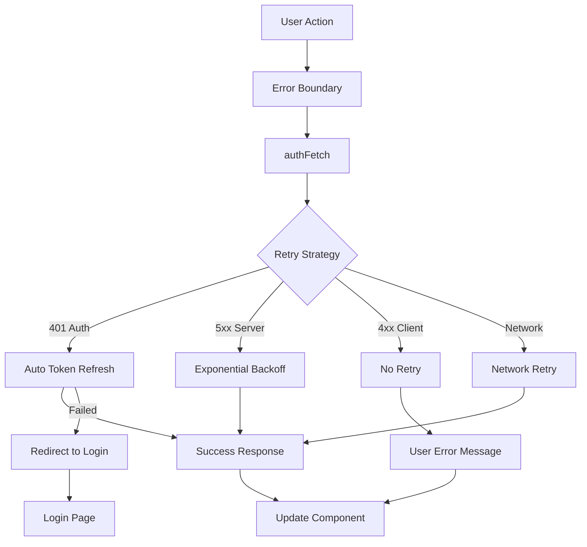

# ADR-0007: Error Handling and Retry Strategy

**Status**: ✅ Implemented
**Date**: January 16, 2025
**Decision Makers**: Frontend Team, Backend Team
**Consulted**: UX Team, DevOps Team
**Informed**: Product Team

## Context

The application requires robust error handling across authentication flows, API requests, and user interactions, with intelligent retry strategies that balance user experience and system reliability.

### Problem Statement
- Handle various error scenarios gracefully (network, auth, server errors)
- Implement retry logic for transient failures
- Provide clear user feedback for error states
- Integrate error tracking with observability tools
- Distinguish between recoverable and non-recoverable errors

## Decision

**We will implement a multi-layered error handling strategy with automatic retry for transient errors, manual retry options for user-initiated actions, and comprehensive error tracking.**

### Error Handling Architecture



### Core Error Handling Implementation

```typescript
// Error classification and retry strategies
export const ErrorTypes = {
  AUTHENTICATION: 'authentication',
  NETWORK: 'network',
  SERVER: 'server',
  CLIENT: 'client',
  VALIDATION: 'validation'
} as const;

export interface ErrorRetryConfig {
  maxRetries: number;
  baseDelay: number;
  maxDelay: number;
  backoffMultiplier: number;
  retryableStatuses: number[];
}

const retryConfigs: Record<string, ErrorRetryConfig> = {
  [ErrorTypes.AUTHENTICATION]: {
    maxRetries: 1,     // Single token refresh attempt
    baseDelay: 0,
    maxDelay: 0,
    backoffMultiplier: 1,
    retryableStatuses: [401]
  },
  [ErrorTypes.NETWORK]: {
    maxRetries: 3,
    baseDelay: 1000,
    maxDelay: 8000,
    backoffMultiplier: 2,
    retryableStatuses: [0, 408, 429, 502, 503, 504]
  },
  [ErrorTypes.SERVER]: {
    maxRetries: 2,
    baseDelay: 2000,
    maxDelay: 10000,
    backoffMultiplier: 2,
    retryableStatuses: [500, 502, 503, 504]
  }
};
```

### AuthFetch Retry Implementation

```typescript
export async function authFetch(
  url: string,
  options: AuthFetchOptions = {}
): Promise<Response> {
  const maxRetries = 3;
  let attempt = 0;

  while (attempt < maxRetries) {
    try {
      const response = await fetch(url, mergedOptions);

      // Handle authentication errors
      if (response.status === 401) {
        const refreshSuccess = await attemptTokenRefresh();
        if (refreshSuccess && attempt < maxRetries - 1) {
          attempt++;
          continue; // Retry with refreshed token
        } else {
          redirectToLogin();
          break;
        }
      }

      // Handle server errors with exponential backoff
      if (response.status >= 500) {
        if (attempt < maxRetries - 1) {
          const delay = Math.min(1000 * Math.pow(2, attempt), 8000);
          await new Promise(resolve => setTimeout(resolve, delay));
          attempt++;
          continue;
        }
      }

      return response;

    } catch (error) {
      // Network or other errors
      if (attempt < maxRetries - 1) {
        const delay = Math.min(1000 * Math.pow(2, attempt), 5000);
        await new Promise(resolve => setTimeout(resolve, delay));
        attempt++;
        continue;
      }
      throw error;
    }
  }

  throw new Error(`Request failed after ${maxRetries} attempts`);
}
```

### React Error Boundaries

```typescript
export class APIErrorBoundary extends Component<Props, State> {
  constructor(props: Props) {
    super(props);
    this.state = { hasError: false, error: null };
  }

  static getDerivedStateFromError(error: Error): State {
    return {
      hasError: true,
      error: {
        message: error.message,
        type: classifyError(error),
        timestamp: new Date().toISOString()
      }
    };
  }

  componentDidCatch(error: Error, errorInfo: ErrorInfo) {
    Sentry.captureException(error, {
      tags: { boundary: 'api-error' },
      extra: errorInfo,
      contexts: {
        component: { name: this.props.fallbackComponent?.name }
      }
    });
  }

  render() {
    if (this.state.hasError) {
      return (
        <ErrorFallback
          error={this.state.error}
          onRetry={() => this.setState({ hasError: false, error: null })}
        />
      );
    }

    return this.props.children;
  }
}
```

### User-Facing Error Components

```typescript
export function ErrorFallback({ error, onRetry }: ErrorFallbackProps) {
  const { announce } = useScreenReaderAnnouncement();

  useEffect(() => {
    if (error) {
      announce(`Error occurred: ${error.message}`, 'assertive');
    }
  }, [error, announce]);

  const getErrorMessage = (error: AppError) => {
    switch (error.type) {
      case ErrorTypes.NETWORK:
        return "Network connection issue. Please check your internet connection.";
      case ErrorTypes.SERVER:
        return "Server temporarily unavailable. Please try again in a moment.";
      case ErrorTypes.AUTHENTICATION:
        return "Session expired. Please log in again.";
      default:
        return "An unexpected error occurred. Please try again.";
    }
  };

  return (
    <div className="flex flex-col items-center justify-center py-8 space-y-4">
      <AlertCircle className="h-12 w-12 text-red-500" />
      <div className="text-center space-y-2">
        <h3 className="text-lg font-semibold">Something went wrong</h3>
        <p className="text-muted-foreground max-w-md">
          {getErrorMessage(error)}
        </p>
      </div>
      <Button onClick={onRetry} variant="outline">
        Try Again
      </Button>
    </div>
  );
}
```

## Consequences

### Positive Consequences

1. **Improved Reliability**
   - Automatic recovery from transient failures
   - Intelligent retry strategies based on error type
   - Reduced user frustration from temporary issues

2. **Better User Experience**
   - Clear error messages for different scenarios
   - Accessibility support with screen reader announcements
   - Manual retry options for user control

3. **Enhanced Observability**
   - Comprehensive error tracking with Sentry
   - Error classification and metrics
   - Retry attempt tracking and analysis

### Negative Consequences

1. **Complexity**
   - Multiple error handling layers to maintain
   - Retry logic can mask underlying issues
   - Testing requires various error scenarios

2. **Performance Impact**
   - Retry delays can affect perceived performance
   - Additional network requests during retries
   - Error boundary overhead

## Testing Strategy

### Error Simulation Testing
```typescript
describe('Error Handling', () => {
  test('should retry server errors with exponential backoff', async () => {
    // Mock server errors and measure retry delays
  });

  test('should not retry client errors (4xx)', async () => {
    // Verify no retries for client errors
  });

  test('should redirect to login after auth failure', async () => {
    // Test authentication error flow
  });
});
```

### Manual Testing Scenarios
1. **Network Interruption**: Disconnect network during API calls
2. **Server Errors**: Trigger 500 errors via error simulation
3. **Authentication Expiry**: Test with expired tokens
4. **Rate Limiting**: Test 429 responses

## How to Test

### Error Boundary Testing
```bash
# Start development server with error simulation
npm run dev

# Trigger client-side error
# Navigate to dashboard and cause component error
```

### API Error Testing
```bash
# Test server error retry
curl -X GET "http://localhost:3004/api/recent-activities" \
  -b cookies.txt -v
# Watch for 500 errors and retry behavior in console

# Test authentication error handling
# Use expired/invalid cookie and monitor retry logic
```

## Open Questions

1. **Retry Budget**: Should there be a global retry budget to prevent cascading failures?
2. **User Notification**: Should users be notified of background retry attempts?
3. **Metrics Collection**: What retry metrics should be tracked for performance monitoring?

## Future Enhancements

1. **Circuit Breaker Pattern**: Implement circuit breakers for failing services
2. **Retry Budget**: Global retry limiting to prevent resource exhaustion
3. **Smart Retry**: Machine learning-based retry decision making
4. **Error Recovery**: Automatic error recovery strategies

---

**Implementation Files**:
- `src/modules/auth/utils/auth-fetch.ts` - Core retry logic
- `src/components/error/error-boundary.tsx` - Error boundary components
- `src/components/error/error-fallback.tsx` - Error display components

**Related ADRs**:
- [ADR-0003](./0003-client-fetch-auth-pattern.md) - Client authentication patterns
- [ADR-0005](./0005-sentry-observability-setup.md) - Error tracking setup