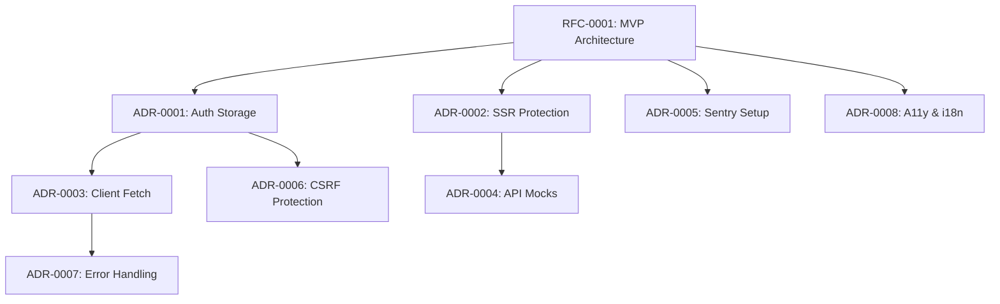

# Decision Log

This document tracks all architectural and technical decisions made in the secure member dashboard project. Each entry links to detailed RFCs (Request for Comments) and ADRs (Architecture Decision Records).

## Timeline

### January 2025

| Date | Decision | Type | Status | Reference |
|------|----------|------|--------|-----------|
| 2025-01-16 | Secure Member Area MVP Architecture | RFC | ✅ Implemented | [RFC-0001](./rfc/0001-secure-member-area-mvp.md) |
| 2025-01-16 | Authentication Storage: HttpOnly Cookies | ADR | ✅ Implemented | [ADR-0001](./adr/0001-auth-storage-httpOnly-cookies.md) |
| 2025-01-16 | Protected SSR Dashboard Pattern | ADR | ✅ Implemented | [ADR-0002](./adr/0002-protected-ssr-dashboard-middleware-vs-handler.md) |
| 2025-01-16 | Client Authentication Fetch Pattern | ADR | ✅ Implemented | [ADR-0003](./adr/0003-client-fetch-auth-pattern.md) |
| 2025-01-16 | API Mocks with Route Handlers | ADR | ✅ Implemented | [ADR-0004](./adr/0004-api-mocks-route-handlers.md) |
| 2025-01-16 | Sentry Observability Integration | ADR | ✅ Implemented | [ADR-0005](./adr/0005-sentry-observability-setup.md) |
| 2025-01-16 | CSRF Protection Strategy | ADR | ✅ Implemented | [ADR-0006](./adr/0006-csrf-and-state-changing-requests.md) |
| 2025-01-16 | Error Handling and Retry Patterns | ADR | ✅ Implemented | [ADR-0007](./adr/0007-error-handling-and-retry-strategy.md) |
| 2025-01-16 | Accessibility and Internationalization | ADR | ✅ Implemented | [ADR-0008](./adr/0008-internationalization-a11y-and-responsiveness.md) |

## Decision Categories

### 🔐 Security
- Authentication storage mechanism
- CSRF protection implementation
- Session management patterns
- API authorization strategies

### 🏗️ Architecture
- Server-side rendering approach
- Client-side data fetching patterns
- Error handling strategies
- Mock API implementation

### 📊 Observability
- Error tracking configuration
- Performance monitoring setup
- User experience analytics
- Development debugging tools

### ♿ User Experience
- Accessibility compliance (WCAG 2.1 AA)
- Internationalization readiness
- Responsive design patterns
- Progressive enhancement

## Decision Status Legend

- ✅ **Implemented** - Decision is implemented and tested in production
- 🚧 **In Progress** - Currently being implemented
- 📋 **Proposed** - Approved and awaiting implementation
- 🔍 **Under Review** - Being evaluated by team
- ❌ **Rejected** - Decision was rejected with documented reasoning
- 📝 **Superseded** - Decision was replaced by a newer one

## Impact Analysis

### High Impact Decisions
1. **RFC-0001**: Overall architecture direction
2. **ADR-0001**: Authentication storage affects entire security model
3. **ADR-0002**: SSR protection impacts performance and UX

### Medium Impact Decisions
4. **ADR-0003**: Client fetch patterns affect data layer
5. **ADR-0005**: Observability affects debugging and monitoring
6. **ADR-0008**: Accessibility affects user base reach

### Low Impact Decisions
7. **ADR-0004**: Mock implementation (development-only)
8. **ADR-0006**: CSRF protection (enhancement over base security)
9. **ADR-0007**: Error handling (UX improvement)

## Cross-Decision Dependencies

## Review Schedule

- **Quarterly Review**: Assess if decisions are still valid
- **Post-Implementation Review**: Document actual outcomes vs expectations
- **Annual Architecture Review**: Consider major architectural changes

## Change Process

1. **Identify Need**: Problem or opportunity requiring architectural decision
2. **Create Document**: RFC for major changes, ADR for specific decisions
3. **Review Process**: Team review and feedback collection
4. **Decision**: Accept, reject, or modify proposal
5. **Implementation**: Track progress and update status
6. **Retrospective**: Document lessons learned and outcomes

---

*Last Updated: January 16, 2025*
*Next Review: April 16, 2025*