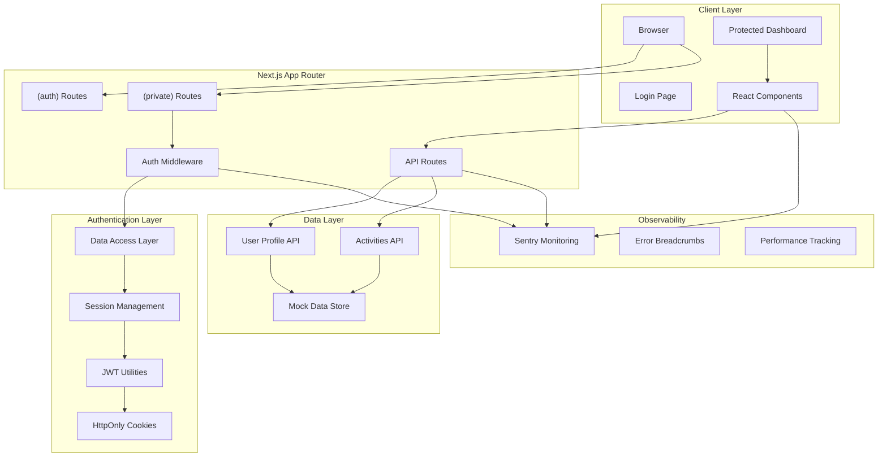
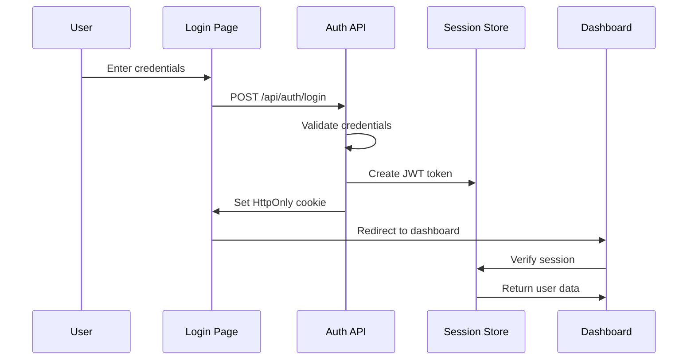
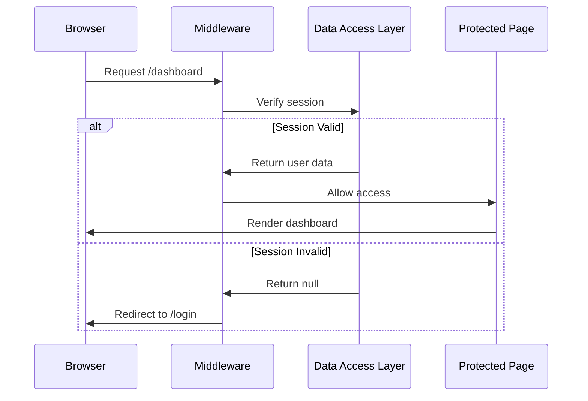

# RFC-0001: Secure Member Area MVP

**Status**: ✅ Implemented
**Date**: January 16, 2025
**Authors**: Development Team
**Reviewers**: Technical Lead

## Summary

This RFC proposes the architecture for a secure member area built with Next.js 15, focusing on authentication security, server-side rendering, and observability. The MVP demonstrates enterprise-grade patterns for modern React applications with emphasis on security-first design.

## Problem Statement

### Current State
- No secure member area for authenticated users
- Need for demonstrating modern Next.js patterns
- Requirement for security-first architecture
- Demand for comprehensive observability

### Pain Points
- Traditional client-side authentication is vulnerable to XSS attacks
- Complex token management and refresh patterns
- Lack of proper server-side protection for sensitive routes
- Missing error tracking and performance monitoring

### Success Criteria
- Secure authentication using HttpOnly cookies
- Server-side rendered protected dashboard
- Comprehensive error tracking and monitoring
- Production-ready security patterns

## High-Level Architecture

## Core Components

### 1. Authentication Flow

### 2. Protected Route Access

## Technical Requirements

### Security Requirements
- **Authentication**: JWT tokens in HttpOnly cookies
- **Authorization**: Server-side session validation
- **CSRF Protection**: SameSite=Strict cookie configuration
- **XSS Prevention**: No client-side token storage
- **Session Management**: Automatic token refresh

### Performance Requirements
- **SSR**: Server-side rendering for protected routes
- **Caching**: Efficient session validation caching
- **Bundle Size**: Optimized client-side JavaScript
- **Loading States**: Proper loading indicators

### Observability Requirements
- **Error Tracking**: Client and server error monitoring
- **Performance Metrics**: Core web vitals tracking
- **User Analytics**: Authentication flow analytics
- **Debug Information**: Development debugging tools

## Implementation Phases

### Phase 1: Core Authentication ✅
- [x] JWT utilities and cookie management
- [x] Login/logout functionality
- [x] Basic route protection

### Phase 2: Protected Dashboard ✅
- [x] Server-side rendered dashboard
- [x] Data Access Layer implementation
- [x] API mock endpoints

### Phase 3: Client-Side Features ✅
- [x] React Query integration
- [x] Automatic token refresh
- [x] Error handling patterns

### Phase 4: Observability ✅
- [x] Sentry error tracking
- [x] Performance monitoring
- [x] User experience analytics

### Phase 5: Production Readiness ✅
- [x] Security hardening
- [x] Accessibility compliance
- [x] Error boundary implementation

## API Contracts

### Authentication Endpoints

| Endpoint | Method | Description | Request | Response |
|----------|---------|-------------|---------|-----------|
| `/api/auth/login` | POST | User authentication | `{email, password}` | `{accessToken, refreshToken}` |
| `/api/auth/refresh` | POST | Token refresh | HttpOnly cookie | New tokens |
| `/api/auth/logout` | POST | User logout | HttpOnly cookie | `{success: true}` |

### Data Endpoints

| Endpoint | Method | Description | Auth Required | Response |
|----------|---------|-------------|---------------|-----------|
| `/api/user-profile` | GET | User profile data | ✅ | `{id, name, email}` |
| `/api/recent-activities` | GET | User activities | ✅ | `{activities: [...]}` |

## Security Considerations

### Threat Model

| Threat | Likelihood | Impact | Mitigation |
|--------|------------|---------|------------|
| XSS Attack | Medium | High | HttpOnly cookies, CSP headers |
| CSRF Attack | Low | Medium | SameSite=Strict cookies |
| Token Theft | Low | High | No client-side storage |
| Session Fixation | Low | Medium | Proper session regeneration |
| Brute Force | Medium | Low | Rate limiting, account lockout |

### Security Headers
- `Strict-Transport-Security`: Force HTTPS
- `X-Content-Type-Options`: Prevent MIME sniffing
- `X-Frame-Options`: Prevent clickjacking
- `Content-Security-Policy`: XSS protection

## Performance Considerations

### Core Web Vitals Targets
- **LCP (Largest Contentful Paint)**: < 2.5s
- **FID (First Input Delay)**: < 100ms
- **CLS (Cumulative Layout Shift)**: < 0.1

### Optimization Strategies
- Server-side rendering for critical paths
- Code splitting for non-critical features
- Image optimization with Next.js Image
- Efficient bundle optimization

## Testing Strategy

### Unit Testing
- Authentication utilities
- Session management functions
- API route handlers
- React component logic

### Integration Testing
- Authentication flow end-to-end
- Protected route access patterns
- API endpoint functionality
- Error handling scenarios

### Security Testing
- Authentication bypass attempts
- Token manipulation testing
- CSRF protection validation
- XSS vulnerability scanning

## Risk Analysis

### High Risks
1. **Authentication Bypass**: Mitigated by server-side validation
2. **Token Leakage**: Mitigated by HttpOnly cookies
3. **Performance Issues**: Mitigated by SSR and caching

### Medium Risks
1. **Third-party Dependencies**: Regular security audits
2. **Browser Compatibility**: Progressive enhancement
3. **Scalability Concerns**: Stateless architecture

### Low Risks
1. **Mock Data Limitations**: Documented limitations
2. **Development Complexity**: Clear documentation
3. **Maintenance Overhead**: Automated testing

## Open Questions

1. **Real Backend Integration**: How will authentication integrate with actual backend services?
2. **Multi-tenant Support**: Will the architecture support multiple organizations?
3. **Mobile App Support**: How will mobile clients authenticate?
4. **Advanced Security**: What additional security measures are needed for production?

## Assumptions

- Next.js 15 App Router is stable for production use
- HttpOnly cookies are acceptable for all target browsers
- Sentry integration meets observability requirements
- Mock APIs are sufficient for MVP demonstration

## Success Metrics

### Technical Metrics
- Zero authentication bypass vulnerabilities
- < 2.5s page load time for dashboard
- 99.9% uptime for authentication services
- < 1% error rate for API endpoints

### User Experience Metrics
- < 5s time to complete login flow
- Zero accessibility violations (WCAG 2.1 AA)
- 95% user satisfaction with loading states
- Clear error messaging for all failure scenarios

## Decision Points

This RFC drives the following architectural decisions:

1. **[ADR-0001](../adr/0001-auth-storage-httpOnly-cookies.md)**: HttpOnly cookie storage
2. **[ADR-0002](../adr/0002-protected-ssr-dashboard-middleware-vs-handler.md)**: SSR protection pattern
3. **[ADR-0003](../adr/0003-client-fetch-auth-pattern.md)**: Client authentication pattern
4. **[ADR-0004](../adr/0004-api-mocks-route-handlers.md)**: Mock API implementation
5. **[ADR-0005](../adr/0005-sentry-observability-setup.md)**: Observability strategy

---

**Implementation Status**: ✅ Completed
**Next Review**: April 16, 2025
**Related Documents**: See decision log for implementation details